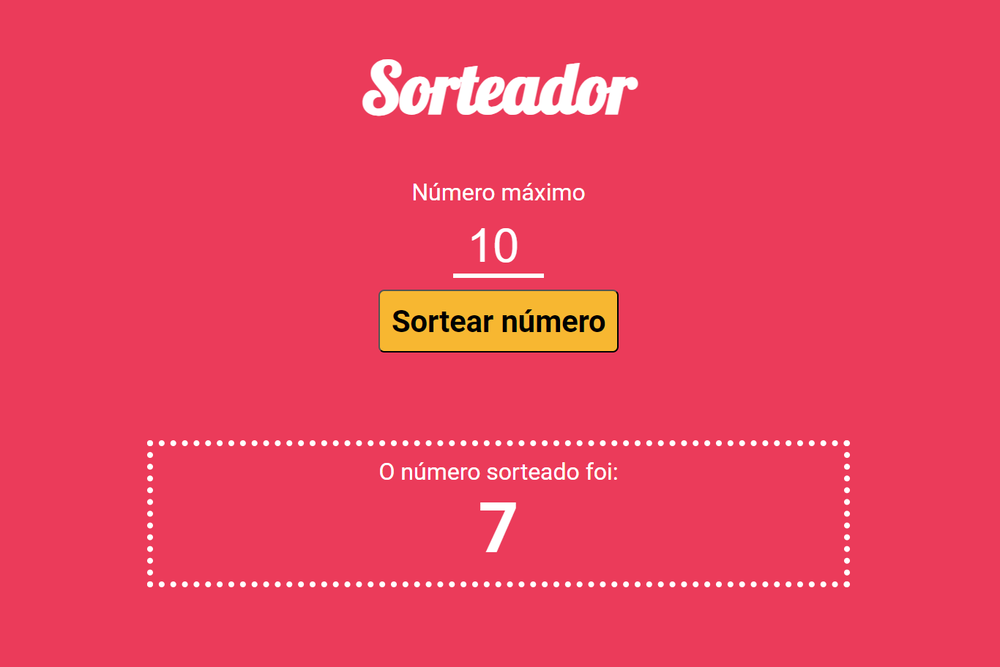

<h1 align="center">
  Sorteador
</h1>

## 📷 Deploy

<h3>LINK: https://grunt-sorteador-beta.vercel.app/</h3>

## 💻 Projeto

Neste projeto realizado em aula, pratiquei o uso do Grunt e Less criando um sorteador de números.

## 🚀 Tecnologias

- Grunt
- Less
- JavaScript
- CSS
- HTML
